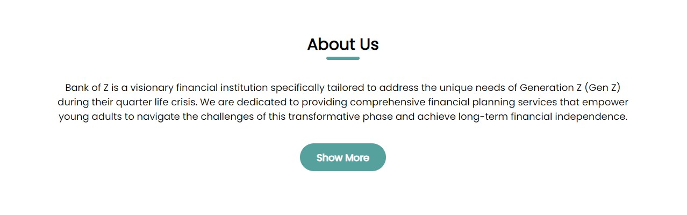
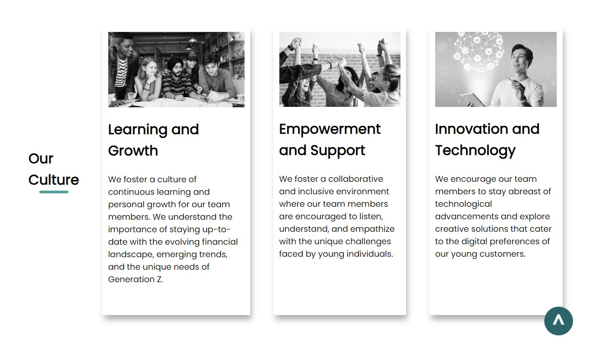
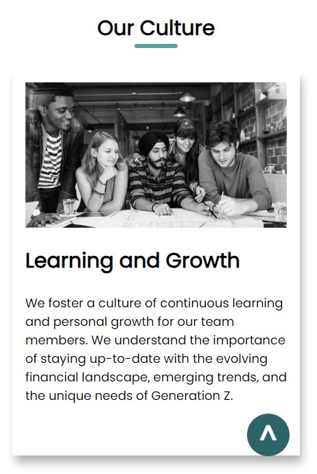
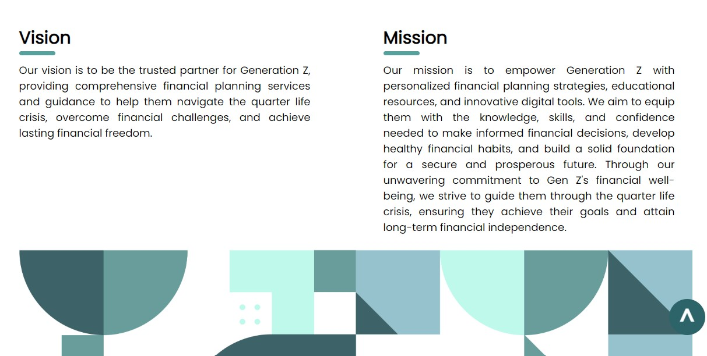
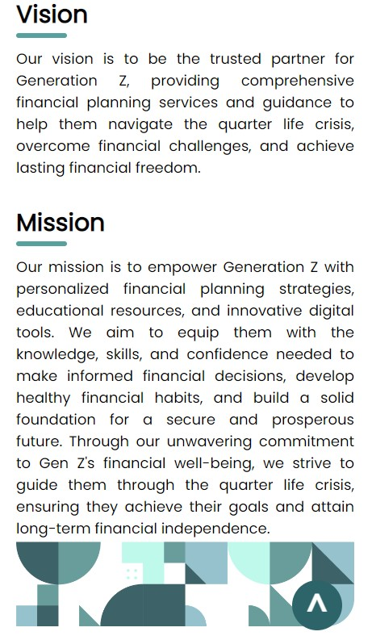
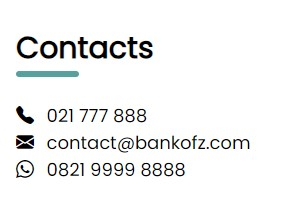

My name is Joko Setiawan, and I am a student of Full Stack Software Engineering at RevoU. I created this website using HTML, CSS, and JavaScript to fulfill the assignment for the fifth week.

**Disclaimer:** This website is a simulated project and does not represent a real organization or entity. All content, including text, images, and information, on this website is fictional and created solely for demonstration and educational purposes. The purpose of this website is to showcase web development skills and simulate the design and functionality of a website.

# Demo

[www.investreeassw4.site](https://investreeassw4.site/)

# Development Process

# 1. Information Gathering
## - Problem
The concept of a "quarter life crisis" refers to a period of uncertainty, anxiety, and self-doubt that individuals often experience in their twenties or early thirties. During this phase, individuals may feel overwhelmed by various personal and professional expectations, leading to a sense of dissatisfaction, confusion, or a lack of direction in life.

Financial challenges can often play a significant role in exacerbating the effects of a quarter life crisis. Here are some ways in which financial factors can be correlated with the quarter life crisis:

1. Economic Pressure: Young adults in the early stages of their careers may face financial pressures, such as student loan debt, entry-level salaries, or the need to establish financial independence. These challenges can amplify feelings of uncertainty and contribute to the overall stress and anxiety associated with the quarter life crisis.

2. Career Uncertainty: Financial stability is closely tied to career choices and progression. Many individuals in their twenties may experience doubts and confusion about their career paths, struggling to find meaningful work or facing challenges in pursuing their desired professions. This uncertainty can further intensify financial concerns and contribute to the quarter life crisis.

3. Social Comparisons: Social media and societal expectations can create a sense of comparison and pressure to achieve certain financial milestones, such as buying a house, starting a family, or achieving a specific level of success. When individuals feel behind or unable to meet these expectations, it can add to the stress and dissatisfaction experienced during the quarter life crisis.

4. Balancing Responsibilities: Young adults often navigate multiple financial responsibilities simultaneously, such as paying bills, saving for the future, managing debt, or supporting family members. These financial obligations, coupled with the internal struggles of the quarter life crisis, can create added strain and uncertainty.

5. Lifestyle Choices: The quarter life crisis may lead individuals to question their lifestyle choices, including spending habits, career decisions, or financial priorities. Evaluating these aspects can sometimes result in financial reevaluation and the need to make adjustments that align better with personal values and long-term goals.

It is important to note that while financial challenges can contribute to the quarter life crisis, they are not the sole cause. The quarter life crisis is a complex phenomenon influenced by various personal, societal, and developmental factors.

Navigating the quarter life crisis requires self-reflection, seeking support from friends, family, or professionals, and developing financial management skills to alleviate financial stress. Engaging in financial planning, budgeting, and seeking guidance from financial advisors can help individuals better manage their financial challenges and find a sense of stability and fulfillment during this transitional phase of life.

## - Opportunity

Young people are considered excellent prospects for financial services for several reasons:

1. Long-Term Potential: Young individuals have a longer time horizon for financial planning and investment. Starting early allows them to benefit from the power of compounding, enabling their investments to grow over time. This long-term potential allows young people to build wealth and secure their financial future.

2. Financial Literacy and Openness to Learning: With the increasing emphasis on financial education, young people today are more likely to be knowledgeable about personal finance concepts. They are open to learning and seeking guidance to make informed financial decisions. This makes them receptive to financial services that can help them navigate complex financial landscapes and achieve their goals.

3. Technological Savviness: Young people are often early adopters of new technologies. They are comfortable using digital platforms, mobile applications, and online services. Financial institutions that provide seamless digital experiences and intuitive financial management tools can effectively cater to the preferences and needs of young customers.

4. Changing Economic Landscape: The economic landscape is continually evolving, with new challenges and opportunities emerging. Young people, as digital natives and future leaders, are well-positioned to adapt to these changes and seize opportunities in emerging industries and markets. Financial services that cater to their specific needs can help them navigate these economic shifts successfully.

5. Diverse Financial Goals: Young individuals have diverse financial goals and aspirations, such as purchasing a home, starting a business, or saving for retirement. Financial services that offer personalized solutions and guidance tailored to individual goals can effectively address the specific needs of young customers and help them achieve their unique objectives.

6. Relationship Building: Establishing a long-term relationship with young customers can be highly beneficial for financial service providers. By building trust and meeting their needs early on, financial institutions can develop lasting partnerships that extend beyond the quarter life crisis and throughout their customers' financial journeys.

It is important for financial service providers to understand the unique characteristics, preferences, and goals of young people to effectively tailor their offerings and engage with this demographic. By recognizing the potential of young individuals and addressing their specific needs, financial institutions can foster lasting relationships and contribute to their financial well-being over time.

# 2. Development

## - Navbar Section

Dekstop:

Mobile:

Hamburger menu active:

This is the navbar section. In this section, I use display flex to arrange the layout. The image and text contain links. On mobile view, I utilize a hamburger menu to display the hidden menu text using CSS and JavaScript.

## - Banner Section

Dekstop:

Mobile:

This is the banner section. In this section, I use tags (h1, p, and a) to create the headline text and use the img tag to insert an image.

To arrange the content layout in the banner, I use display flex. There is a difference in appearance where the flex-direction changes from column in mobile view to flex-direction: row; in desktop view. Furthermore, I use srcset to create different images between mobile and desktop views.

## - About Us

this section contain tags (h2, p, a), and layouting used flex.

## - Our Culture Section

Dekstop:

Mobile:

To arrange the content layout in the banner, I use display flex. There is a difference in appearance where the flex-direction changes from column in mobile view to flex-direction: row; in desktop view.

## - Vision Mission Section

Dekstop:

Mobile:

To arrange the content layout in the banner, I use display flex. There is a difference in appearance where the flex-direction changes from column in mobile view to flex-direction: row; in desktop view.

## - Contact Section

Dekstop:

Mobile:

To arrange the content layout in the banner, I use display flex. There is a difference in appearance where the flex-direction changes from column in mobile view to flex-direction: row; in desktop view. In this section, I use Bootstrap icons.

## - To Top Button

This button is used to facilitate users in returning to the home page. I created this button using CSS and JavaScript.

# How To Run This Project

The steps:
1. Download or clone the repository to your local.
2. Open inex.html in your browser to view the web app.
3. customize as you want.
4. there is a images directory to put your image.